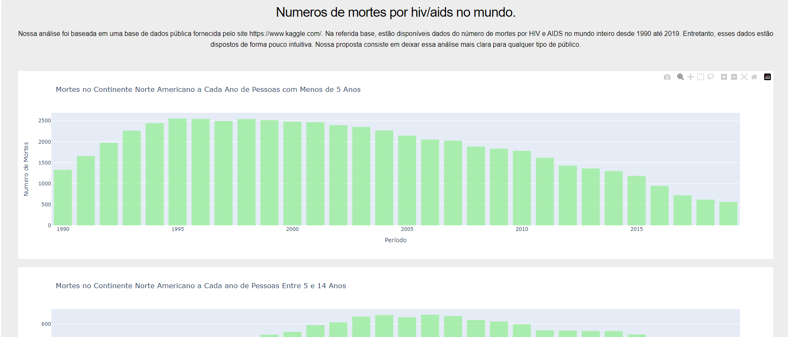
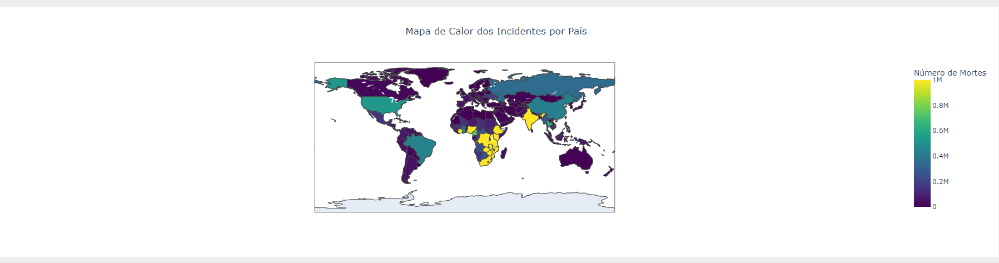
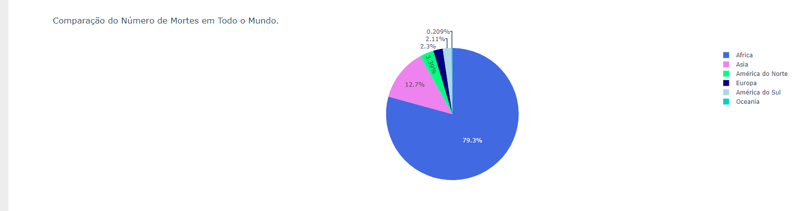

# Projeto de Análise de Dados sobre Mortes por HIV/AIDS

## Desenvolvimento Rápido de Aplicativos em Python
1. Alguns gráficos que foram gerados .

##

##

---

## Sumário

1. [Introdução](#introdução)
2. [Tecnologias Utilizadas](#tecnologias-utilizadas)
3. [Objetivo](#objetivo)
4. [Funcionalidades](#funcionalidades)
5. [Executando o Projeto](#executando-o-projeto)
6. [Licença](#licença)

---

## Introdução

Neste projeto da disciplina de Desenvolvimento Rápido de Aplicativos em Python, foi realizado uma análise dos dados relacionados ao número de mortes por HIV/AIDS em todo o mundo. Os dados foram obtidos do site Kaggle e foram processados utilizando bibliotecas como Pandas e Plotly. Além disso, foi desenvolvida uma dashboard interativa utilizando o framework Dash.

---

## Tecnologias Utilizadas

- Python
- Pandas
- Plotly
- Dash
- Git e Github

---

## Objetivo

O objetivo principal deste projeto foi se familiarizar com o uso das ferramentas como Pandas e Plotly para análise de dados. Além disso, buscamos criar gráficos informativos e implementá-los em uma dashboard interativa usando o Dash. A finalidade é proporcionar uma fácil visualização dos dados para qualquer tipo de público.

---

## Funcionalidades

- Análise exploratória dos dados de mortes por HIV/AIDS.
- Geração de diversos gráficos para representar os dados.
- Criação de uma dashboard interativa para facilitar a visualização.

---

## Executando o Projeto

1. Clone o repositório: `git clone https://github.com/alyssonrafael/projeto_DEV.rapido.python`
2.  Tenha um ambiente preparado para rodar Jupyter Notebooks com. 
3. Execute todas as celuas à ultima celula criara o link para acesso da dash

## Visualização mais prática

1. Você pode utilizar o Google Colab para visualizar a dashboard. Basta abrir o arquivo do projeto e garantir que o deaths-from-hiv-by-age (1).csv esteja disponível em seu ambiente no Colab.

---

## Licença

Este projeto está sob a [Licença MIT]
